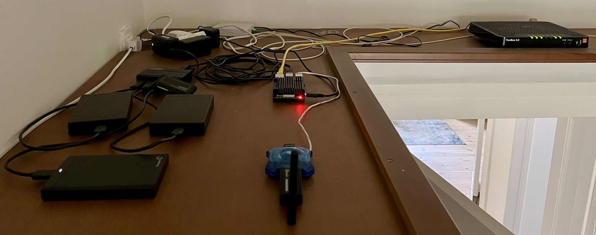

# RPI (IoT)
> Przykład implementacji IoT z użyciem RaspberryPi
- [RPI (IoT)](#rpi-iot)
  - [Instalacja](#instalacja)
  - [Sprzęt](#sprzęt)
  - [Usługi / Docker](#usługi--docker)
    - [embyserver](#embyserver)
    - [homeassistant](#homeassistant)
    - [homebridge](#homebridge)
    - [monitoring-cadvisor](#monitoring-cadvisor)
    - [monitoring-grafana](#monitoring-grafana)
    - [monitoring-node-exporter](#monitoring-node-exporter)
    - [monitoring-pihole-exporter](#monitoring-pihole-exporter)
    - [monitoring-prometheus](#monitoring-prometheus)
    - [openvpn-as](#openvpn-as)
    - [pihole](#pihole)
    - [portainer](#portainer)
    - [prowlarr](#prowlarr)
    - [pyload-ng](#pyload-ng)
    - [radarr](#radarr)
    - [samba](#samba)
    - [sonarr](#sonarr)
    - [transmission](#transmission)
  - [Sieć / Porty](#sieć--porty)

## Instalacja

Od lewej:

* dyski USB 3.0 2,5 cala - 3 sztuki (4TB - media, 4TB - backups, 1TB - config)
* Hub 3.0 z oddzielnym zasilaniem. On łączy dyski USB i RPI przez port USB 3.0
* czytnik kart SD - z włozoną kartą microSD do wykonywania backup image kart microSD w RPI
* z tyłu - zasilacze - Hub'a, RPI, Orange Funbox
* białe pudełko - terminal światłowodu
* z czerwoną LED - RPI
* "niebieski" - hub USB 2.0 podłączony do RPI do portu USB 2.0, do niego podłączone - Dongle Zigbee i Dongle Bluetooth - uwaga: maksymalnie odsunięte od RPI (zmniejszenie zakłóceń)
* zółty kabel - to gigabit LAN łączący RPI i Orange Funbox 3
* Orange Funbox 3

## Sprzęt

* Rapsberry Pi 4 model B WiFi DualBand Bluetooth 4GB RAM 1,8GHz  
https://botland.com.pl/moduly-i-zestawy-raspberry-pi-4b/14647-raspberry-pi-4-model-b-wifi-dualband-bluetooth-4gb-ram-18ghz-5056561800349.html

* Obudowa Geekworm Raspberry Pi 4 Obudowa chłodnicy, Malina Pi 4B ze stopu aluminium Pasywne Chłodzenie dla Raspberry Pi 4 Model B Tylko (Pi 4B Case Without Fan)  
https://www.amazon.pl/Geekworm-Raspberry-chlodnicy-aluminium-Chlodzenie/dp/B07VD5L1VY

* SONOFF Zigbee 3.0 USB Dongle Plus | ZBDongle-E  
https://sonoff.tech/pl-pl/products/sonoff-zigbee-3-0-usb-dongle-plus-zbdongle-e

* Nano adapter USB Bluetooth 5.0  
https://www.tp-link.com/pl/home-networking/adapter/ub500/

* Xiaomi Temperature and HuXiaomidity Monitor 2  
https://www.amazon.pl/Xiaomi-Temperature-HuXiaomidity-Monitor-2/dp/B08C7KVDJW/

* Czujnik temperatury wilgotności ZIGBEE SONOFF SNZB-02  
https://allegro.pl/oferta/czujnik-temperatury-wilgotnosci-zigbee-snzb-02-17236553109

* SONOFF DW2-Wi-Fi Bezprzewodowy czujnik drzwi/okien  
https://sonoff.tech/pl-pl/products/sonoff-dw2-wi-fi-wireless-door-window-sensor

* Inteligentne gniazdko ZigBee NOUS A1Z  
https://noussmart.pl/products/inteligentne-gniazdko-zigbee-nous-a1z

* Syrenka alarmowa ZigBee  
https://www.amazon.pl/alarmowa-maksymalny-podwójny-regulacji-antykradzieżowy/dp/B0B3F82M8K/

## Usługi / Docker

### embyserver
* lscr.io/linuxserver/emby:latest  
* https://emby.media  
* Serwer multimedialny umożliwiający strumieniowanie filmów, seriali, muzyki i zdjęć na różne urządzenia, z automatycznym rozpoznawaniem metadanych i transkodowaniem.

---

### homeassistant
* ghcr.io/home-assistant/home-assistant:stable  
* https://www.home-assistant.io  
* Platforma do automatyzacji inteligentnego domu obsługująca tysiące urządzeń IoT, integracji i scenariuszy automatyzacji.

---

### homebridge
* homebridge/homebridge:latest  
* https://homebridge.io  
* Lekki serwer pozwalający na integrację urządzeń nieobsługujących Apple HomeKit z ekosystemem Apple.

---

### monitoring-cadvisor
* cleanstart/cadvisor:latest  
* https://github.com/google/cadvisor  
* Narzędzie Google do monitorowania wykorzystania zasobów kontenerów Docker w czasie rzeczywistym (CPU, RAM, sieć, dysk).

---

### monitoring-grafana
* grafana/grafana:latest  
* https://grafana.com  
* System wizualizacji danych i metryk z wielu źródeł, umożliwiający tworzenie interaktywnych dashboardów monitorujących.

---

### monitoring-node-exporter
* prom/node-exporter:latest  
* https://github.com/prometheus/node_exporter  
* Eksporter metryk systemowych dla Prometheusa – monitoruje wykorzystanie CPU, pamięci, dysku i sieci hosta.

---

### monitoring-pihole-exporter
* ekofr/pihole-exporter:latest  
* https://github.com/eko/pihole-exporter  
* Eksporter statystyk Pi-hole dla Prometheusa – umożliwia zbieranie danych o zapytaniach DNS, blokowanych domenach i wydajności.

---

### monitoring-prometheus
* prom/prometheus:latest  
* https://prometheus.io  
* System monitoringu i alertowania zbierający metryki z eksportowanych źródeł, idealny do integracji z Grafaną.

---

### openvpn-as
* openvpn/openvpn-as  
* https://openvpn.net  
* Serwer VPN z interfejsem administracyjnym, zapewniający bezpieczny zdalny dostęp do sieci i zasobów.

---

### pihole
* pihole/pihole:latest  
* https://pi-hole.net  
* System DNS sinkhole blokujący reklamy, trackery i złośliwe domeny na poziomie sieci lokalnej.

---

### portainer
* portainer/portainer-ce:latest  
* https://www.portainer.io  
* Lekki panel WWW do zarządzania kontenerami Docker, Docker Swarm i Kubernetes w sposób wizualny.

---

### prowlarr
* lscr.io/linuxserver/prowlarr:latest  
* https://prowlarr.com  
* Menedżer indeksatorów dla aplikacji takich jak Sonarr, Radarr czy Lidarr – ułatwia zarządzanie źródłami treści.

---

### pyload-ng
* lscr.io/linuxserver/pyload-ng:latest  
* https://pypi.org/project/pyload-ng/  
* Menedżer pobierania plików z obsługą hostów, kont premium i kolejkowania zadań, dostępny przez interfejs webowy.

---

### radarr
* lscr.io/linuxserver/radarr:latest  
* https://radarr.video  
* Automatyzuje pobieranie i organizowanie filmów z różnych źródeł przy użyciu trackerów i usług indeksujących.

---

### samba
* crazymax/samba  
* https://www.samba.org  
* Implementacja protokołu SMB/CIFS, umożliwiająca współdzielenie plików i drukarek między systemami Linux i Windows.

---

### sonarr
* lscr.io/linuxserver/sonarr:latest  
* https://sonarr.tv  
* Aplikacja do automatycznego wyszukiwania, pobierania i organizowania seriali telewizyjnych z różnych źródeł.

---

### transmission
* lscr.io/linuxserver/transmission:latest  
* https://transmissionbt.com  
* Lekki klient BitTorrent z interfejsem webowym i obsługą automatyzacji pobierania.

## Sieć / Porty

//TODO
