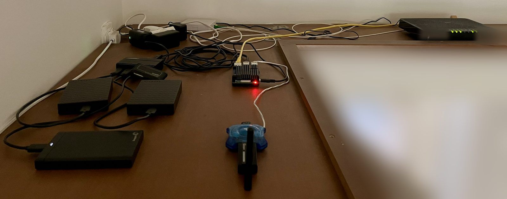

# RPI (IoT)
> Domowy serwer na Raspberry Pi 4: Home Assistant (Zigbee, Bluetooth), usługi w Dockerze, monitoring Prometheus + Grafana i VPN. Wszystkie dane trzymane są na dyskach USB, a nie na karcie SD.
- [RPI (IoT)](#rpi-iot)
  - [Instalacja (zdjęcie)](#instalacja-zdjęcie)
  - [Sprzęt](#sprzęt)
  - [Usługi / Docker](#usługi--docker)
    - [dozzle](#dozzle)
    - [embyserver](#embyserver)
    - [homeassistant](#homeassistant)
    - [immich](#immich)
    - [immich-folder-album-creator](#immich-folder-album-creator)
    - [lemp](#lemp)
    - [monitoring-cadvisor](#monitoring-cadvisor)
    - [monitoring-grafana](#monitoring-grafana)
    - [monitoring-node-exporter](#monitoring-node-exporter)
    - [monitoring-pihole-exporter](#monitoring-pihole-exporter)
    - [monitoring-prometheus](#monitoring-prometheus)
    - [ntopng](#ntopng)
    - [openvpn-hwdsl2](#openvpn-hwdsl2)
    - [openwebrx](#openwebrx)
    - [owa](#owa)
    - [pihole](#pihole)
    - [portainer](#portainer)
    - [prowlarr](#prowlarr)
    - [pyload-ng](#pyload-ng)
    - [radarr](#radarr)
    - [samba](#samba)
    - [sonarr](#sonarr)
    - [transmission](#transmission)
  - [Skrypty](#skrypty)
  - [Architektura](#architektura)
  - [Sieć / Porty](#sieć--porty)
  - [Konfiguracja pod własne środowisko](#konfiguracja-pod-własne-środowisko)

## Instalacja (zdjęcie)



Od lewej:

* dyski USB 3.0 2,5 cala - 3 sztuki (4TB - media, 4TB - backups, 1TB - config)
* Hub 3.0 z oddzielnym zasilaniem. On łączy dyski USB i RPI przez port USB 3.0
* czytnik kart SD - z włożoną kartą microSD do wykonywania backup image kart microSD w RPI
* z tyłu - zasilacze - Hub'a, RPI, routera
* białe pudełko - terminal światłowodu
* z czerwoną LED - RPI
* "niebieski" - hub USB 2.0 podłączony do RPI do portu USB 2.0, do niego podłączone - Dongle Zigbee i Dongle Bluetooth - uwaga: maksymalnie odsunięte od RPI (zmniejszenie zakłóceń)
* żółty kabel - to gigabit LAN łączący RPI z routerem
* router operatora (prawy górny róg)

## Sprzęt

* Raspberry Pi 4 model B WiFi DualBand Bluetooth 4GB RAM 1,8GHz  
https://botland.com.pl/moduly-i-zestawy-raspberry-pi-4b/14647-raspberry-pi-4-model-b-wifi-dualband-bluetooth-4gb-ram-18ghz-5056561800349.html

* Obudowa Geekworm Raspberry Pi 4 Obudowa chłodnicy, Malina Pi 4B ze stopu aluminium Pasywne Chłodzenie dla Raspberry Pi 4 Model B Tylko (Pi 4B Case Without Fan)  
https://www.amazon.pl/Geekworm-Raspberry-chlodnicy-aluminium-Chlodzenie/dp/B07VD5L1VY

* SONOFF Zigbee 3.0 USB Dongle Plus | ZBDongle-E  
https://sonoff.tech/pl-pl/products/sonoff-zigbee-3-0-usb-dongle-plus-zbdongle-e

* Nano adapter USB Bluetooth 5.0  
https://www.tp-link.com/pl/home-networking/adapter/ub500/

* Xiaomi Temperature and Humidity Monitor 2  
https://www.amazon.pl/Xiaomi-Temperature-HuXiaomidity-Monitor-2/dp/B08C7KVDJW/

* Czujnik temperatury wilgotności ZIGBEE SONOFF SNZB-02  
https://allegro.pl/oferta/czujnik-temperatury-wilgotnosci-zigbee-snzb-02-17236553109

* SONOFF DW2-Wi-Fi Bezprzewodowy czujnik drzwi/okien  
https://sonoff.tech/pl-pl/products/sonoff-dw2-wi-fi-wireless-door-window-sensor

* Inteligentne gniazdko ZigBee NOUS A1Z  
https://noussmart.pl/products/inteligentne-gniazdko-zigbee-nous-a1z

* Syrenka alarmowa ZigBee  
https://www.amazon.pl/alarmowa-maksymalny-podwójny-regulacji-antykradzieżowy/dp/B0B3F82M8K/


## Usługi / Docker

Każda usługa ma katalog `Docker/<katalog>/` z plikiem `docker-compose.yml`. Wszystkie aktualizuje jeden skrypt [Docker/upgrade.sh](Docker/upgrade.sh). Usługi zatrzymane zostają w repo, ale nie są uruchomione; `docker compose up -d` w ich katalogu je wystartuje. Katalog `Docker/` w repo odpowiada katalogowi `~/Docker` na RPi.

| Usługa | Katalog | Status |
|---|---|---|
| [dozzle](#dozzle) | `dozzle` | aktywna |
| [embyserver](#embyserver) | `emby` | aktywna |
| [homeassistant](#homeassistant) | `homeassistant` | aktywna |
| [immich](#immich) | `immich` | aktywna |
| [immich-folder-album-creator](#immich-folder-album-creator) | `immich-folder-album-creator` | uruchamiana ręcznie |
| [lemp](#lemp) | `lemp` | zatrzymana |
| [monitoring-cadvisor](#monitoring-cadvisor) | `rpi-monitoring` | aktywna |
| [monitoring-grafana](#monitoring-grafana) | `rpi-monitoring` | aktywna |
| [monitoring-node-exporter](#monitoring-node-exporter) | `rpi-monitoring` | aktywna |
| [monitoring-pihole-exporter](#monitoring-pihole-exporter) | `rpi-monitoring` | aktywna |
| [monitoring-prometheus](#monitoring-prometheus) | `rpi-monitoring` | aktywna |
| [ntopng](#ntopng) | `ntopng` | zatrzymana |
| [openvpn-hwdsl2](#openvpn-hwdsl2) | `hwdsl2-openvpn` | aktywna |
| [openwebrx](#openwebrx) | `openwebrx` | zatrzymana |
| [owa](#owa) | `owa` | zatrzymana |
| [pihole](#pihole) | `pi-hole` | aktywna |
| [portainer](#portainer) | `portainer` | aktywna |
| [prowlarr](#prowlarr) | `media` | zatrzymana |
| [pyload-ng](#pyload-ng) | `pyload` | zatrzymana |
| [radarr](#radarr) | `media` | zatrzymana |
| [samba](#samba) | `samba` | aktywna |
| [sonarr](#sonarr) | `media` | zatrzymana |
| [transmission](#transmission) | `media` | zatrzymana |

### dozzle
* amir20/dozzle:latest  
* https://dozzle.dev  
* Lekki podgląd logów wszystkich kontenerów Docker w przeglądarce, na żywo, bez przechowywania logów.

---

### embyserver
* lscr.io/linuxserver/emby:latest  
* https://emby.media  
* Serwer multimedialny umożliwiający strumieniowanie filmów, seriali, muzyki i zdjęć na różne urządzenia, z automatycznym rozpoznawaniem metadanych i transkodowaniem.

---

### homeassistant
* ghcr.io/home-assistant/home-assistant:stable  
* https://www.home-assistant.io  
* Platforma do automatyzacji inteligentnego domu obsługująca tysiące urządzeń IoT, integracji i scenariuszy automatyzacji.

---

### immich
* ghcr.io/immich-app/immich-server  
* https://immich.app  
* Samohostowane rozwiązanie do backupu i przeglądania zdjęć oraz filmów, z automatycznym rozpoznawaniem twarzy i obiektów.

---

### immich-folder-album-creator
* salvoxia/immich-folder-album-creator  
* https://github.com/Salvoxia/immich-folder-album-creator  
* Narzędzie tworzące w Immich albumy na podstawie struktury katalogów z zewnętrznej biblioteki zdjęć.

---

### lemp
* nginx + php + mariadb + adminer  
* Stos LEMP (Linux, Nginx, MariaDB, PHP) hostujący dodatkowe aplikacje webowe (m.in. OWA) wraz z panelem administracyjnym bazy danych.

---

### monitoring-cadvisor
* cleanstart/cadvisor:latest  
* https://github.com/google/cadvisor  
* Narzędzie Google do monitorowania wykorzystania zasobów kontenerów Docker w czasie rzeczywistym (CPU, RAM, sieć, dysk).

---

### monitoring-grafana
* grafana/grafana:latest  
* https://grafana.com  
* System wizualizacji danych i metryk z wielu źródeł, umożliwiający tworzenie interaktywnych dashboardów monitorujących.

---

### monitoring-node-exporter
* prom/node-exporter:latest  
* https://github.com/prometheus/node_exporter  
* Eksporter metryk systemowych dla Prometheusa – monitoruje wykorzystanie CPU, pamięci, dysku i sieci hosta.

---

### monitoring-pihole-exporter
* ekofr/pihole-exporter:latest  
* https://github.com/eko/pihole-exporter  
* Eksporter statystyk Pi-hole dla Prometheusa – umożliwia zbieranie danych o zapytaniach DNS, blokowanych domenach i wydajności.

---

### monitoring-prometheus
* prom/prometheus:latest  
* https://prometheus.io  
* System monitoringu i alertowania zbierający metryki z eksportowanych źródeł, idealny do integracji z Grafaną.

---

### ntopng
* ntop/ntopng_arm64.dev  
* https://www.ntop.org/products/traffic-analysis/ntop  
* Narzędzie do monitorowania i analizy ruchu sieciowego w czasie rzeczywistym, wspierane przez bazę ClickHouse.

---

### openvpn-hwdsl2
* hwdsl2/openvpn-server  
* https://github.com/hwdsl2/docker-openvpn  
* Lekki serwer OpenVPN (natywny arm64), który zastąpił cięższy openvpn-as (wycofany). Klientów dodaje `genclient.sh`, a odwołuje `revokeclient.sh`.

---

### openwebrx
* jketterl/openwebrx  
* https://www.openwebrx.de  
* Odbiornik SDR (Software Defined Radio) z interfejsem webowym, umożliwiający odbiór i udostępnianie fal radiowych przez przeglądarkę.

---

### owa
* vladk1m0/docker-owa (Open Web Analytics)  
* https://www.openwebanalytics.com  
* Samohostowane narzędzie do analityki ruchu na stronach WWW, alternatywa dla Google Analytics.

---

### pihole
* pihole/pihole:latest  
* https://pi-hole.net  
* System DNS sinkhole blokujący reklamy, trackery i złośliwe domeny na poziomie sieci lokalnej.

---

### portainer
* portainer/portainer-ce:latest  
* https://www.portainer.io  
* Lekki panel WWW do zarządzania kontenerami Docker, Docker Swarm i Kubernetes w sposób wizualny.

---

### prowlarr
* lscr.io/linuxserver/prowlarr:latest  
* https://prowlarr.com  
* Menedżer indeksatorów dla aplikacji takich jak Sonarr, Radarr czy Lidarr – ułatwia zarządzanie źródłami treści.

---

### pyload-ng
* lscr.io/linuxserver/pyload-ng:latest  
* https://pypi.org/project/pyload-ng/  
* Menedżer pobierania plików z obsługą hostów, kont premium i kolejkowania zadań, dostępny przez interfejs webowy.

---

### radarr
* lscr.io/linuxserver/radarr:latest  
* https://radarr.video  
* Automatyzuje pobieranie i organizowanie filmów z różnych źródeł przy użyciu trackerów i usług indeksujących.

---

### samba
* crazymax/samba  
* https://www.samba.org  
* Implementacja protokołu SMB/CIFS, umożliwiająca współdzielenie plików i drukarek między systemami Linux i Windows.

---

### sonarr
* lscr.io/linuxserver/sonarr:latest  
* https://sonarr.tv  
* Aplikacja do automatycznego wyszukiwania, pobierania i organizowania seriali telewizyjnych z różnych źródeł.

---

### transmission
* lscr.io/linuxserver/transmission:latest  
* https://transmissionbt.com  
* Lekki klient BitTorrent z interfejsem webowym i obsługą automatyzacji pobierania.

## Skrypty

Skrypty z katalogu `Docker/` (na RPi leżą w `~/Docker`) oraz narzędzia diagnostyczne z `scripts/`:

| Skrypt | Opis |
|---|---|
| [Docker/upgrade.sh](Docker/upgrade.sh) | Aktualizuje jedną usługę, np. `./upgrade.sh homeassistant`: pobiera obrazy, przebudowuje stosy z `build:` (lemp), podmienia tylko zmienione kontenery i czyści nieużywane obrazy (`PRUNE=0` wyłącza czyszczenie) |
| [Docker/check-updates.sh](Docker/check-updates.sh) | Sprawdza, czy dla działających kontenerów są nowsze obrazy (niczego nie zmienia) |
| [Docker/backup-configs.sh](Docker/backup-configs.sh) | Pakuje do zipa konfigurację usług (bez dużych danych) |
| [Docker/rpi-monitoring/scripts/](Docker/rpi-monitoring/scripts/) | Usługa systemd z timerem, która sprawdza błędy USB i wystawia metryki dla node-exportera |
| [scripts/rpi-health.sh](scripts/rpi-health.sh) | Szybki raport stanu systemu: load, RAM, swap, dyski, kontenery |
| [scripts/rpi-daily.sh](scripts/rpi-daily.sh) | Codzienny przegląd (tylko odczyt): USB/xHCI, mounty, rfkill, błędy kernela, SMART, miejsce, kontenery (OOM, restarty), karta SD, maskowane logi HA; na końcu podsumowanie problemów |
| [scripts/disk-usage.sh](scripts/disk-usage.sh) | Co zajmuje miejsce na dyskach danych (tylko odczyt): katalogi, typy plików, rok modyfikacji, duże pliki, śmieci, duplikaty, usunięte, ale otwarte pliki, Docker; na końcu podsumowanie |
| [scripts/dump-docker-configs.sh](scripts/dump-docker-configs.sh) | Wypisuje wszystkie pliki `docker-compose` z `~/Docker` |
| [scripts/list-data1t.sh](scripts/list-data1t.sh) | Przegląd zawartości dysku danych: rozmiary, struktura i uprawnienia |
| [scripts/inventory.sh](scripts/inventory.sh) | Spisuje stan hosta przed reinstalacją OS (tylko odczyt). Wynik zawiera dane wrażliwe, nie publikuj go |

## Architektura

* **Host:** Raspberry Pi 4 (4 GB RAM) z Raspberry Pi OS Lite 64-bit i Dockerem z Compose v2. Na karcie SD jest tylko system i katalog `~/Docker` z plikami compose i `.env`.
* **Dyski USB 3.0** przez hub z własnym zasilaniem:
  * `DATA1T_DIR`: konfiguracje i bazy usług, TSDB Prometheusa;
  * `DANE4T_DIR`: zdjęcia, pobrane pliki, `data-root` Dockera;
  * `FILMY4T_DIR`: filmy.
* **Smart home:** Home Assistant w `network_mode: host`, ze Zigbee (SONOFF ZBDongle-E) i Bluetooth (TP-Link UB500). Dongle są na osobnym hubie USB 2.0, z dala od dysków USB 3.0, żeby ograniczyć zakłócenia 2,4 GHz.
* **Sieć:** Pi-hole jako DNS dla LAN, OpenVPN (hwdsl2) do zdalnego dostępu.
* **Monitoring:** Prometheus zbiera metryki z node-exporter (host), cAdvisor (kontenery), pihole-exporter i Home Assistant; Grafana je wizualizuje. Prometheus łączy się z HA przez `host.docker.internal`, więc w konfiguracji nie ma adresu IP.
* **Zasoby:** kontenery mają limity `mem_limit`/`cpus`, żeby jedna usługa nie zagłodziła reszty na 4 GB RAM.

## Sieć / Porty

Porty hosta (RPi). Usługi w `network_mode: host` używają swoich portów domyślnych.

| Usługa | Port(y) | Uwagi |
|---|---|---|
| dozzle | 8888 | |
| emby | 8096 (http), 8920 (https), DLNA | `network_mode: host` |
| homeassistant | 8123 | `network_mode: host` |
| immich | 2283 | |
| lemp | 13524 (nginx), 8010 (adminer) | zatrzymana |
| media | 9091 (transmission), 51413 tcp/udp (torrent), 8989 (sonarr), 7878 (radarr), 9696 (prowlarr) | zatrzymana |
| ntopng | 3000 (web); clickhouse tylko lokalnie: `127.0.0.1:19000` (tcp), `127.0.0.1:19004` (mysql) | ntopng w `network_mode: host`, clickhouse w sieci bridge; zatrzymana |
| openvpn-hwdsl2 | 1194/udp (`VPN_PORT`) | `network_mode: host`; jedyny port przekierowany z internetu |
| openwebrx | 8073 | zatrzymana |
| owa | 8081 | zatrzymana |
| pi-hole | 53 tcp/udp (DNS), 8089 (http), 8090 (https) | |
| portainer | 9443 (HTTPS) | |
| pyload | 8000 | zatrzymana |
| rpi-monitoring | 3030 (grafana), 9090 (prometheus, z logowaniem) | cAdvisor, node-exporter i pihole-exporter nie wystawiają portów; Prometheus zbiera z nich metryki w sieci Dockera |
| samba | 139, 445 | `network_mode: host` |

Poza VPN żaden port nie powinien być wystawiony do internetu. Wszystkie wystawione panele wymagają logowania.

## Konfiguracja pod własne środowisko

Repo zawiera konfigurację mojego RPi. Żeby usługi wstały u Ciebie, trzeba podać własne sekrety, adresy, ścieżki do dysków i urządzenia. Hasła, adresy z sieci lokalnej i identyfikatory sprzętu nie trafiają do repo. Każda usługa, która ich potrzebuje, ma plik `.env.example` (w `hwdsl2-openvpn`: `vpn.env.example`).

### Kroki ogólne

Wymagania: Docker z Compose v2 (co najmniej 2.18), a dla skryptów `jq` i `zip` (`sudo apt install -y jq zip`).

```bash
git clone https://github.com/wghrrr/IoT.git
cp -r IoT/Docker ~/Docker         # katalog Docker/ w repo = ~/Docker na RPi
cd ~/Docker/<usługa>
cp .env.example .env            # uzupełnij wartości: dyski + pozostałe (patrz tabele niżej)
docker compose config -q        # walidacja: brak komunikatu oznacza, że jest OK
docker compose up -d
```

Aktualizacja jednej usługi: `~/Docker/upgrade.sh <usługa>`.

### Zasada: żadnych danych na karcie SD

Karta SD zawiera tylko system i katalog `~/Docker` z plikami compose i `.env`. Wszystkie dane usług (configi, bazy, media, logi) zapisują się na zamontowanych dyskach. Ścieżki dysków nie są wpisane w `docker-compose.yml`, tylko podawane przez zmienne w `.env`: `DATA1T_DIR`, `DANE4T_DIR`, `FILMY4T_DIR` i `DOCKER_DATA_ROOT` (katalog `data-root` Dockera). Mogą wskazywać ten sam dysk. Brak zmiennej przerywa start (`${VAR:?}`), więc dane nie trafią przypadkiem na kartę SD. Skrypty hosta (`backup-configs.sh`, `usb-health-check.sh`) przerywają działanie, gdy dysk docelowy nie jest zamontowany.

### Co ustawić w poszczególnych usługach

| Usługa | Pliki do utworzenia lub uzupełnienia | Co ustawić | Uwagi |
|---|---|---|---|
| dozzle | — | — | Wystarczy dopasować ścieżkę danych |
| emby | — | ścieżki bibliotek w `volumes:` | `network_mode: host` dla DLNA. Transkodowanie programowe (akceleracja sprzętowa w Emby wymaga Emby Premiere; wtedy dodaj `devices: /dev/dri, /dev/video10-12` i `group_add: video`). Limity `mem_limit: 1g`, `cpus: 3` |
| homeassistant | `homeassistant/.env` | `ZIGBEE_DEVICE`: ścieżka dongla z `ls /dev/serial/by-id/` | Bez dongla Zigbee usuń sekcję `devices:`. Bluetooth działa przez `/run/dbus` |
| immich | `immich/.env` | `UPLOAD_LOCATION`, `DB_DATA_LOCATION`, `DB_PASSWORD`, `DB_USERNAME`, `DB_DATABASE_NAME`, `TZ`, `IMMICH_VERSION` | Zewnętrzna biblioteka zdjęć jest w `volumes:` (`/mnt/photos`) |
| immich-folder-album-creator | `immich-folder-album-creator/.env` i `immich-folder-album-creator/immich_api_key.secret` | `IMMICH_API_URL=http://<adres-RPi>:2283/api`; w pliku `.secret` sam klucz API z Immicha (Konto → Klucze API) | Uruchamiana ręcznie; `user: 1001:1001` musi mieć prawo odczytu biblioteki zdjęć |
| lemp | `lemp/.env` | `MYSQL_ROOT_PASSWORD` | Obraz PHP budowany lokalnie z [php-dockerfile](Docker/lemp/php-dockerfile). `nginx.conf` i `conf.d/` trzeba utworzyć w `${DATA1T_DIR}/lemp_data/config/` (nie ma ich w repo) |
| media (transmission, sonarr, radarr, prowlarr) | `media/.env` | `TRANSMISSION_USER`, `TRANSMISSION_PASS` | Dopasuj ścieżki pobierania i bibliotek; sonarr i radarr muszą widzieć ten sam katalog `downloads` co transmission |
| ntopng | `ntopng/.env` | `NTOPNG_CLICKHOUSE_PASSWORD` | Licencja (`/etc/ntopng.license`) opcjonalna, wolumen zakomentowany. Kolektor nasłuchuje tylko na `127.0.0.1:5556` (dla nprobe); do monitorowania ruchu LAN dodaj `-i eth0`. Dane w nazwanych wolumenach Dockera |
| openvpn-hwdsl2 | `hwdsl2-openvpn/vpn.env` | `VPN_DNS_NAME` (publiczny adres lub DDNS), `VPN_PORT`, `VPN_PROTO` | Przekieruj port (domyślnie 1194/UDP) na routerze na RPi. Profile klientów tworzy `./genclient.sh <nazwa>`, a odwołuje `./revokeclient.sh <nazwa>`. Pliki `*.ovpn` zawierają klucze i są w `.gitignore` |
| openwebrx | — | — | Wymaga odbiornika SDR na USB (`/dev/bus/usb`) |
| owa | `owa/.env` | `MYSQL_ROOT_PASSWORD`, `MYSQL_PASSWORD` | — |
| pi-hole | `pi-hole/.env` | `PIHOLE_WEBPASSWORD` | Port 53 na hoście musi być wolny (np. wyłączony `systemd-resolved` stub) |
| portainer | — | — | Przed pierwszym startem: `docker volume create portainer_data`. Tylko HTTPS (9443) z certyfikatem samopodpisanym. Dane w nazwanym wolumenie `portainer_data` (w `data-root` Dockera). Pełny dostęp do `docker.sock`, więc tylko w LAN i z mocnym hasłem |
| pyload | — | ścieżki w `volumes:` | Domyślne dane logowania podaje dokumentacja obrazu [linuxserver/pyload-ng](https://docs.linuxserver.io/images/docker-pyload-ng/); zmień je po pierwszym logowaniu |
| rpi-monitoring | `rpi-monitoring/.env` oraz na dysku w `${DATA1T_DIR}/rpi-monitoring_data/prometheus/config/`: `prometheus.yml`, `web-config.yml`, `prom_password`, `hass_token` | `PIHOLE_WEBPASSWORD` (ta sama wartość co w `pi-hole/.env`), `PIHOLE_HOSTNAME` (IP hosta z pi-hole), dyski | Przed pierwszym startem: `docker network create rpimonitor_default`. Prometheus wymaga logowania (basic auth): [web-config.yml](Docker/rpi-monitoring/prometheus/web-config.yml) z hashem bcrypt hasła (`htpasswd -nBC 12 ""`), a samo hasło w pliku `prom_password` dla joba `prometheus-self`. `hass_token` to token długoterminowy HA (Profil → Bezpieczeństwo). Pliki z sekretami: `chmod 600`, właściciel UID 1000. Grafanę konfigurują zmienne `GF_*` w compose; [grafana.ini](Docker/rpi-monitoring/grafana/grafana.ini) jest pusty, ale musi istnieć w `${DATA1T_DIR}/rpi-monitoring_data/grafana/` (inaczej Docker utworzy w tym miejscu katalog). Źródło danych w Grafanie: `http://monitoring-prometheus:9090` z logowaniem (Basic authentication). Skrypty z [scripts/](Docker/rpi-monitoring/scripts/) są opcjonalne i obecnie niewdrożone; do zbierania ich metryk trzeba dodać w node-exporterze `--collector.textfile.directory` i wolumen z katalogiem `textfile_collector` |
| samba | — | użytkownicy i udziały w `${DATA1T_DIR}/samba_data/config.yml` (format [crazymax/samba](https://github.com/crazy-max/docker-samba)) | Nie ma tego pliku w repo, bo zawiera użytkowników i hasła (`chmod 600`). Zalecane w sekcji `global:` pliku: `server min protocol = SMB3`, `map to guest = Never`, `restrict anonymous = 2`, a jeśli udziały nie zawierają dowiązań symbolicznych, także `wide links = no`. Udziały z `guestok: no` i `validusers`. Obraz domyślnie wyłącza NetBIOS (nasłuch tylko na 445) i ogranicza dostęp do prywatnych zakresów IP (`hosts allow`) |
